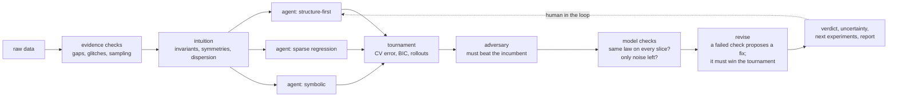

# eqdisc: an autoresearch lab for the laws of nature

**Give it raw measurements. It proposes equations, tests them, attacks them and revises them. It stops when the evidence settles on one law, or when it can tell you exactly which measurement would settle it.**

|  | eqdisc | baseline |
|---|---|---|
| Blinded held-out systems recovered exactly, single agent ([protocol](docs/benchmark_v1.md)) | **10 / 12** | 1 / 12 (SINDy) |
| LAGEOS-1 satellite, 30-day forecast from data alone ([details](docs/honest_oos.md)) | **12 km** | 3,170 km (neural net) |
| Blinded chaotic KS, valid forecast horizon | **4.48 Lyapunov times** | 0.78 (FNO) |
| Corrupted data sets that end confidently wrong (dev, [details](docs/evidence.md)) | **0 / 96** | n/a |

The agent never sees the system's name, a description or meaningful variable names. It gets data only.

```bash
eqdisc-discover examples/data/KS_data.mat
```
```
[1/7] evidence checks on the data
      all data checks passed
[2/7] intuition pre-analysis on KS_data
      [high]   the spatial mean of u is conserved: the right-hand side is a total derivative (flux form) ...
[3/7] 3 parallel branches: ['structure-first', 'symbolic', 'sparse-regression']
[4/7] tournament
[5/7] adversary (red team) attacks the winner
[6/7] revise from the checks, then assess the final model
[7/7] write-up

CONFIDENT: We are confident this is your equation.        u_t = -1.00 u u_x - 1.00 u_xx - 1.00 u_xxxx
report: runs/discover_KS_data/report.html  (cost $1.35, 451 s)
```

---

## The research loop



- **Hypothesise.** A non-LLM pre-analysis reads the data's structure (conservation laws, symmetries, the dispersion relation, fixed points) and seeds three Claude agents. Each agent follows a different research strategy.
- **Experiment.** The agents run real numerics through a shared toolbox ([docs/toolbox.md](docs/toolbox.md)): weak-form and ensemble SINDy, PySR, skeleton fits, coordinate transforms, symmetry search, and their own analysis code and plots. The LLM never does the arithmetic.
- **Select.** A statistical tournament picks the winner, not an LLM vote.
- **Falsify.** A red-team agent attacks the winner, and a challenger is adopted only if it wins the same tournament.
- **Diagnose and revise.** Deterministic checks ask two questions: does the law hold on every slice of the data, and is only noise left over? A failed check proposes a concrete fix, such as a forcing term, a source or a missing nonlinearity. The fix is kept only if it wins.
- **Decide what to measure next.** All plausible models are simulated, and the report ranks the next experiments by how strongly they would separate those models.
- **Learn.** `eqdisc-agent --learn` writes lessons that later sessions retrieve (`memory/lessons.jsonl`), and `eqdisc-evolve` evolves the agents' playbook or discovery program AlphaEvolve-style. Held-out sets are reported, never optimised.

## What makes it different

- **Competition, not consensus.** Parallel agents follow different strategies. A held-out statistical tournament decides between them, and an adversary has to win that same tournament to replace the incumbent.
- **It knows when not to trust itself.** Model checks can veto a confident verdict, and the checks never call an LLM:
  - coefficients must agree across runs, early vs late time, regions of space and amplitude;
  - the residual must be indistinguishable from noise.
- **Diagnosis drives revision.** "The residual follows time" becomes "add a forcing term at this frequency", and the system tests that fix. This closes the loop from falsify to revise.
- **It says what to measure next.** Uncertainty-driven experiment design names the initial condition that best separates the surviving models, and the coefficient it would pin down.
- **Built against self-deception.**
  - Blinded benchmarks rename every variable and change every coefficient by ±25%, so they measure discovery rather than recall of textbook equations.
  - Results are scored only on refitted coefficients.
  - Earlier results that leaked domain information are publicly retracted ([honest_oos](docs/honest_oos.md)).

## Results

**Blinded held-out benchmark:** 12 systems never used for tuning, 2% noise, scored on unseen initial conditions ([full table](docs/benchmark_v1.md)).

| method | exact recoveries |
|---|---|
| plain SINDy | 1 / 12 |
| auto-configured SINDy (heuristics, no LLM) | 3 / 12 |
| single Claude agent | **10 / 12** |
| full pipeline (branches, tournament, adversary) | **3 / 3** (subset) |

**Out of sample, data only** ([details and caveats](docs/honest_oos.md)):
- **LAGEOS-1, a real satellite, in random units.** The agent inferred Kepler + J₂ from the numbers alone. 30-day forecast error: 12 km. A neural net trained on the same data: 3,170 km. Kepler alone: 9,037 km.
- **Blinded Kuramoto–Sivashinsky.** Valid for 4.48 Lyapunov times; the true PDE gives 4.53 and an FNO 0.78. Weak SINDy alone matches the agent here.
- **Gray–Scott (The Well, 5% noise).** Exact structure. VRMSE over steps 6–12 is 0.068, against 0.45 for an FNO on the same data.

**Corrupted data** ([docs/evidence.md](docs/evidence.md)). 4 PDEs × 8 corruptions: outliers, gaps, censored tails, hidden forcing, hidden sources, run-to-run variation, extreme-value terms.
- The no-LLM pipeline is never confidently wrong: 0 of 96 dev cases, with 64 recovered exactly.
- The revise step turns hidden-forcing cases from 0/12 to 6/12 recovered, and hidden-source cases from 0/12 to 4/12.
- These are calibration seeds. Held-out seeds are next.

## See exactly what it did

Every run writes `runs/discover_<data>_<time>/`:
- **`report.html`** contains:
  - the verdict (*CONFIDENT*, *CONFIDENT IN PREDICTIONS*, *COLLECT MORE DATA*, *INCONCLUSIVE*);
  - the equation, the key steps, uncertainty for each term, data and model checks, revisions, ranked next experiments and questions for you.
- **`ledger.jsonl`** is an append-only record of every finding, data repair, tournament, revision and verdict, each tagged with dataset and config hashes.
- **`discovery.json`** and the agent transcripts hold the full research trail.

The demo app runs `streamlit run demo/app.py`; set `EQDISC_DEMO_FAKE=1` to replay results without API calls. The talk track is in `demo/README.md`.

## Efficient by design

- **Cost.** A full run takes $1–3 and 2–8 minutes. Each agent branch costs about $0.3–0.5. For a cheap pass, use `--branches 2 --no-adversary`.
- **Cheap checks.** Every check, the grade and the verdict are deterministic numpy/scipy, with no tokens. They add about 1% to an assessment, and model checks are cached per model.
- **No wasted calls.** Identical repeated tool calls are blocked. The critic is skipped when only 2 or fewer tool calls remain in the budget.

## Run it

```bash
git clone https://github.com/danieldeh/autoresearch-pde && cd autoresearch-pde
python -m venv .venv && source .venv/bin/activate
pip install -e ".[notebooks]"            # add ",pysr" for symbolic regression
export ANTHROPIC_API_KEY=...             # or `ant auth login`, or a gitignored .env file
python -m eqdisc.tests.smoke             # full pipeline with Claude stubbed out: no API calls
```

```bash
eqdisc-discover examples/data/KS_data.mat                     # real Kuramoto–Sivashinsky data
eqdisc-discover my_data.csv --human --context "..."           # review the result yourself
```

**Inputs.** `.csv/.tsv/.txt`, `.mat`, `.npz/.npy`, `.h5` and `.json`, holding either time series or spatio-temporal fields. The ingester infers the layout and writes a data card listing every assumption, with how to override it.

**From Python.**
```python
from eqdisc.orchestrate import discover
res = discover("my_data.csv")
res["verdict"], res["final_model"], res["report"]
```

**From Claude Code.** Open the repo and say *"discover the equations in data/foo.csv"*. This uses the shipped `discover-equations` skill.

## Reproduce and extend

```bash
eqdisc-datagen --suite default                             # 29 ODE/PDE systems with hidden test sets
eqdisc-blind SYSTEM                                        # blinded variant: renamed variables, ±25% coefficients
python -m eqdisc.benchmark                                 # SINDy vs auto vs agent vs full pipeline
python -m eqdisc.corrupt --seeds 0 1 2                     # corrupted-data suite
python -m eqdisc.bench_evidence --arm B --split dev        # score it (no LLM)
```

Rule: tune on development systems only, and report held-out results separately.

To point it at a new problem class:
- add a tool in `eqdisc/agent.py` (implementations live in `eqdisc/toolbox.py`);
- add a research strategy in `orchestrate.STRATEGIES`;
- add method guidance in `eqdisc/playbook.md`.

Static laws y = f(x) and the notebooks are covered in [docs/sr_mode.md](docs/sr_mode.md).

## Next

- Ablations against Claude alone: Claude with a code sandbox vs eqdisc vs eqdisc with evidence checks, on held-out seeds.
- Revision families that don't assume a shape: multi-frequency forcing, spline sources.
- A partition test that decides whether a large coherent event is real dynamics or corrupt data.
- Hidden variables and delay embeddings.

## Limitations

- Every relevant state variable must be measured.
- Forcing is proposed and tested only as a sinusoid in time or a single spatial mode.
- Coordinate transforms are ODE-only. PDEs are supported on 1-D and 2-D grids with one boundary type.
- Thresholds are calibrated heuristics. Treat the verdict as an evidence-backed opinion, not a proof.
- LLM priors pull toward textbook forms. The assessment checks every term against the data, and the blinded benchmark measures the residual effect.

**Related work:** LLM-SR / LLM-SRBench, KeplerAgent, STRIDE, AlphaEvolve, weak-form SINDy (Messenger & Bortz), E-SINDy.

MIT license. Example data: see `THIRD_PARTY_NOTICES.md`.
